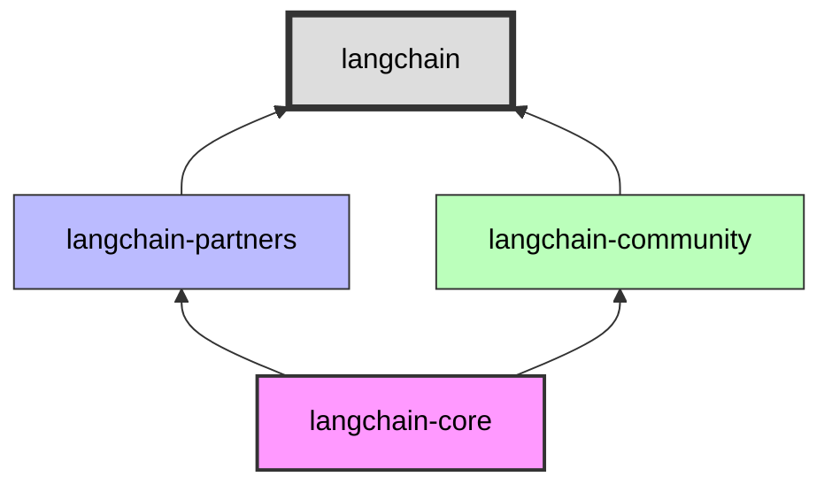

| **Subtopic**                                      | **Focus & Purpose**                       | **Key Concepts / Details**                                             | **One-Line Recall**                                            |
| ------------------------------------------------- | ----------------------------------------- | ---------------------------------------------------------------------- | -------------------------------------------------------------- |
| **[[LC1.1.3.1 langchain-core Package]]**          | Understand the foundational abstractions  | Base interfaces, LCEL primitives, core types, minimal dependencies     | `langchain-core` provides the foundational abstractions.       |
| **[[LC1.1.3.2 langchain-community Package]]**     | Access third-party integrations           | Community-maintained integrations, model providers, vector stores      | `langchain-community` houses third-party integrations.         |
| **[[LC1.1.3.3 langchain Package]]**               | Orchestrate chains and agents             | Higher-level constructs, chains, agents, orchestration utilities       | `langchain` combines core + community for full functionality.  |
| **[[LC1.1.3.4 Partner Packages]]**                | Use vendor-specific integrations          | `langchain-openai`, `langchain-anthropic`, dedicated provider packages | Partner packages offer optimized vendor-specific integrations. |
| **[[LC1.1.3.5 Abstractions vs Implementations]]** | Distinguish interfaces from concrete code | Abstract base classes, swappable backends, dependency inversion        | Core defines abstractions; community provides implementations. |

# Core Packages: The Architectural Split

To master LangChain, you must understand that it is no longer a single library. It is a **tiered architecture**. This separation was engineered to solve the "heavy dependency" problem—ensuring that utilizing a simple prompt template doesn't force you to install 500MB of vector database drivers.

---

## 1. The Hierarchy of Abstraction

The ecosystem is organized by **volatility**: the most stable code is at the bottom, and the most rapidly changing integrations are at the edges.



*   **langchain-core**: The foundation (Base classes, LCEL).
*   **langchain-community/partners**: The implementations (OpenAI, Chroma, Wikipedia).
*   **langchain**: The orchestrator (Agent loops, easy-to-use chains).

---

## 2. langchain-core: The Invariant Standard

This is the **Standard Definition** layer. It defines *what* a ChatModel involves, but not *how* OpenAI works.

*   **Role**: Defines the API Contracts (Interfaces).
*   **Stability**: High. Breaking changes are extremely rare.
*   **Dependencies**: Minimal.
*   **Includes**:
    *   `BaseChatModel`, `BaseRetriever`, `BaseTool`
    *   **LCEL** (LangChain Expression Language) syntax (`|`, `.invoke`, `.stream`)
    *   `PromptTemplate` logic

> **Mental Model**: Think of this as the **USB-C Standard**. It describes how things connect, but doesn't implement a specific device.

---

## 3. langchain-community: The Bazaar

This is where the ecosystem lives. It is a massive collection of integrations maintained by the open-source community.

*   **Role**: Connects Core abstractions to the real world (APIs, DBs).
*   **Stability**: Medium/Low. Depends on third-party API changes.
*   **Dependencies**: Heavy (optional). You install only what you need.
*   **Includes**:
    *   `ChatVertexAI`, `HuggingFaceHub` (Generic integrations)
    *   `WikipediaLoader`, `DuckDuckGoSearch`
    *   `FAISS`, `Chroma` vector stores

> **Mental Model**: This is the **App Store**. It has everything you might need, from calculator apps to weather widgets.

---

## 4. Partner Packages: The VIP Lane

For critical infrastructure (OpenAI, Anthropic, AWS, Google), generic community support wasn't enough. These providers have dedicated packages maintained in collaboration with the vendors.

*   **Packages**: `langchain-openai`, `langchain-anthropic`, `langchain-fireworks`.
*   **Role**: Optimized, high-priority support for specific model families.
*   **Key Advantage**: When OpenAI releases a new feature (e.g., JSON mode), it appears here first, often on Day 0.

---

## 5. langchain: The Orchestrator

This is the package you likely thought was "LangChain." It sits on top of everything.

*   **Role**: Cognitive architectures and usage-ready chains.
*   **Includes**:
    *   **Agents**: ReAct agents, OpenAI Tools Agents.
    *   **Retrieval Strategies**: MMR, Self-Querying, ParentDocument.
    *   **Memory Implementations**: BufferMemory, SummaryMemory.
*   **Why use it?**: You can build an app just with `core` + `openai`, but `langchain` gives you the pre-built algorithms (the "recipes") to combine them intelligently.

---

## 6. Composition in Practice

How do these layers interact in a single line of code?

```python
# 1. Core: Defines the protocol (PromptTemplate, StrOutputParser)
from langchain_core.prompts import ChatPromptTemplate
from langchain_core.output_parsers import StrOutputParser

# 2. Partner: Provides the compute engine (ChatOpenAI)
from langchain_openai import ChatOpenAI

# 3. LangChain (Orchestrator): Could provide the agent loop (not shown here, but implied)

model = ChatOpenAI() # Partner
prompt = ChatPromptTemplate.from_template("...") # Core

chain = prompt | model | StrOutputParser() # Core (LCEL)
```

**The Takeaway**: You are mixing and matching layers. `Core` provides the grammar, `Partners` provide the nouns, and `LangChain` provides the sentences.

---

## Quick Reference

| Package | Role | Metaphor | Use Case |
| :--- | :--- | :--- | :--- |
| **langchain-core** | Protocols & Syntax | **USB Port** | Defining chains, custom runnables. |
| **langchain-partners**| Optimized Integrations | **Apple Charger** | Production apps using major LLMs. |
| **langchain-community**| General Integrations | **Universal Adapter** | Connecting to niche tools/DBs. |
| **langchain** | Algorithms & Agents | **Operating System** | Building complex agents/RAG loops. |
