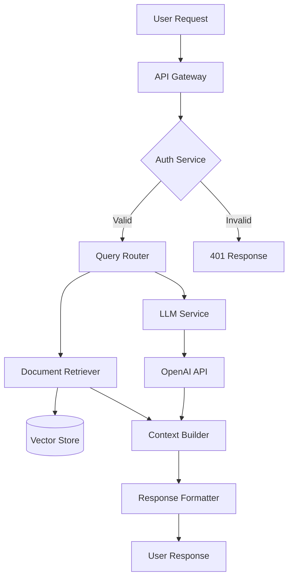

| **Subtopic** | **Focus & Purpose** | **Key Concepts / Details** | **One-Line Recall** |
|---|---|---|---|
| **LC12.1.8.1 ADRs** | Decisions | Architecture Decision Records | Document why decisions were made. |
| **LC12.1.8.2 C4 Model** | Diagrams | Context, Container, Component, Code | Visualize at different levels. |
| **LC12.1.8.3 System Context** | Overview | System and external dependencies | Show the big picture. |
| **LC12.1.8.4 Component Diagrams** | Detail | Internal structure | Document how parts connect. |
| **LC12.1.8.5 Runbooks** | Operations | Operational procedures | Document how to run the system. |

# Architecture Documentation: Communicating Design

Documenting architecture for teams and stakeholders.

---

## 1. Architecture Decision Records (ADRs)

```markdown
# ADR 001: Use Vector Database for Document Retrieval

## Status
Accepted

## Context
We need to store and retrieve documents for RAG. Options considered:
- Traditional search (Elasticsearch)
- Vector database (Chroma, Pinecone)
- Hybrid approach

## Decision
Use Chroma vector database for document retrieval.

## Consequences
**Positive:**
- Better semantic search
- Native embedding support
- Simple deployment (SQLite backend)

**Negative:**
- Learning curve for team
- Limited full-text search capabilities
- May need hybrid solution later

## Alternatives Considered
1. Elasticsearch: Better full-text, but semantic search requires plugins
2. Pinecone: Managed but vendor lock-in and cost

---
Date: 2024-01-15
Deciders: Architecture Team
```

---

## 2. C4 Model Diagrams

**Level 1: System Context**
```
┌─────────────┐
│   Users     │
└──────┬──────┘
       │
   ┌───▼────────────┐
   │  LangChain     │
   │  Application   │
   └───┬────────┬───┘
       │        │
  ┌────▼───┐ ┌─▼──────┐
  │ OpenAI │ │ Chroma │
  │  API   │ │   DB   │
  └────────┘ └────────┘
```

**Level 2: Container**
```
LangChain Application
├── API Gateway (FastAPI)
├── Query Service (Python)
├── Document Service (Python)
└── Vector Store (Chroma)
```

**Level 3: Component**
```
Query Service
├── QueryRouter
├── ContextBuilder
├── LLMInvoker
└── ResponseFormatter
```

---

## 3. System Context Documentation

```markdown
# LangChain Chatbot System

## System Purpose
Enterprise customer support chatbot using RAG.

## Key System Components
1. **User Interface**: Web app (React)
2. **API Gateway**: FastAPI service
3. **LangChain Services**: Query processing, document management
4. **External Dependencies**:
   - OpenAI GPT-4 API
   - Chroma vector database
   - PostgreSQL (user data)
   - Redis (caching)

## Data Flow
1. User asks question via web UI
2. API Gateway authenticates and routes
3. Query Service retrieves relevant documents from Chroma
4. LLM generates response using context
5. Response returned to user

## Non-Functional Requirements
- Latency: < 3s P95
- Availability: 99.9%
- Security: OAuth 2.0, encrypted in transit
```

---

## 4. Component Diagrams

```python
# Mermaid diagram in docs
"""

"""
```

---

## 5. Operational Runbooks

```markdown
# Runbook: Deploying LangChain API

## Prerequisites
- Kubernetes cluster access
- Docker image built and pushed
- Environment variables configured

## Deployment Steps

1. **Update Image Tag**
   ```bash
   kubectl set image deployment/langchain-api \
     langchain-api=myregistry/langchain-api:v1.2.3
   ```

2. **Verify Rollout**
   ```bash
   kubectl rollout status deployment/langchain-api
   ```

3. **Check Health**
   ```bash
   curl https://api.example.com/health
   ```

## Rollback Procedure
```bash
kubectl rollout undo deployment/langchain-api
```

## Monitoring
- Dashboard: https://grafana.example.com/d/langchain
- Alerts: #langchain-alerts Slack channel

## Common Issues

### Issue: High 50x errors
**Symptoms**: Error rate > 1%
**Diagnosis**: Check LLM API status, database connections
**Resolution**: 
1. Check `kubectl logs -l app=langchain-api`
2. Verify API keys are valid
3. Check rate limits

### Issue: Slow responses
**Symptoms**: P95 > 5s
**Diagnosis**: Check vector store performance
**Resolution**: Scale up workers or increase cache TTL
```

---

## Quick Reference

| Doc Type | Audience | Frequency |
|----------|----------|-----------|
| **ADRs** | Team | Per decision |
| **C4 Diagrams** | All stakeholders | Per release |
| **Runbooks** | Ops team | Living doc |
| **API Docs** | Developers | Auto-generated |
