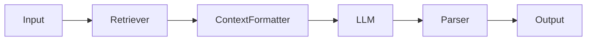

| **Subtopic**                                          | **Focus & Purpose**                          | **Key Concepts / Details**                                                      | **One-Line Recall**                                                 |
| ----------------------------------------------------- | -------------------------------------------- | ------------------------------------------------------------------------------- | ------------------------------------------------------------------- |
| **[[LC2.5.8.1 Documenting Chain Behavior]]**          | Describe what chains do                      | Behavior descriptions, purpose, functionality                                   | Document chain behavior and purpose clearly.                        |
| **[[LC2.5.8.2 Input Output Specs]]**                  | Document data contracts                      | Schema docs, type information, examples                                         | Specify input/output schemas in documentation.                      |
| **[[LC2.5.8.3 Usage Examples]]**                      | Show how to use chains                       | Code examples, common patterns, copy-paste ready                                | Include usage examples in chain documentation.                      |
| **[[LC2.5.8.4 Maintenance]]**                         | Keep docs current                            | Doc updates, version sync, review process                                       | Maintain documentation as chains evolve.                            |
| **[[LC2.5.8.5 Documentation Standards]]**             | Apply consistent standards                   | Format standards, templates, tooling                                            | Apply consistent documentation standards.                           |

# Documentation Patterns: Keeping It Understandable

If another developer can't understand your chain in 5 minutes, it's poorly documented.

---

## 1. The Essential Docstring

Every exported chain should have:

```python
"""
RAG Question-Answering Chain.

Takes a user question, retrieves relevant documents from the vector store,
and uses GPT-4 to synthesize an answer with citations.

Input:
    {"question": str}

Output:
    {"answer": str, "sources": list[str]}

Example:
    >>> chain.invoke({"question": "What is the capital of France?"})
    {"answer": "Paris", "sources": ["https://..."]}
"""
```

---

## 2. Diagrams (Mermaid / ASCII)

For complex chains, a visual is worth 1000 lines of prose.



Store these diagrams in the docstring or a separate `docs/` folder.

---

## 3. LangServe Playground (Auto-Docs)

When you deploy with LangServe, it automatically generates a Playground UI with:
*   Input Schema (from Pydantic).
*   Output Schema.
*   Example requests.

This is "living documentation" and always matches your code.

---

## Quick Reference

| Doc Element | Purpose |
| :--- | :--- |
| **Docstring** | Quick explanation. |
| **Input/Output Schema** | Formal contract. |
| **Diagram** | Visual flow. |
| **LangServe Playground** | Interactive demo. |
